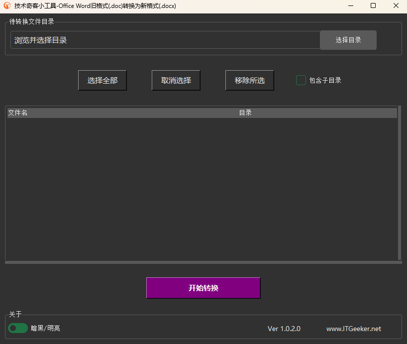

# 开源Office Word格式转换小工具 - 转换Word旧版doc为新版docx

#### 介绍
技术奇客(ITGeeker)出品的Office系列小工具 - 转换Word旧版doc为新版docx。

    - 选定目录后可选择是否包含子目录，软件会列出所有旧版的doc文件。
    - 根据要求只选择部分或全部doc文件进行批量处理。
    - 转换后的.docx文件保存在源文件相同目录，文件名带有-converted字样。

技术奇客是奇客罗方智能科技的关联公司。更多信息可访问 ITGeeker技术奇客官方博客 [www.itgeeker.net](https://www.itgeeker.net) 或者 GeekerCloud奇客罗方智能科技 [https://www.geekercloud.com](https://www.geekercloud.com)

软件支持当下流行的节能型暗黑和明亮主题切换，Tkinter主题采用了Forest开源主题: [https://github.com/rdbende/Forest-ttk-theme](https://https://github.com/rdbende/Forest-ttk-theme)

>暗黑主题

>明亮主题

#### 软件架构
软件基于Python 3.11版本和TK UI开发，可以运行于Windows 10/11，系统需安装Office 2003之后的版本。Windows系统下载发行版的exe可执行文件运行即可，也可根据需求自行试用pyinstaller编译。

#### 运行及使用说明

> Windows版本

    1.  下载可执行文件
    2.  双击文件并执行
    3.  选择需要处理的目录
    4.  选择要转换的文件
    5.  开始处理

（注意：转换后的.docx文件保存在源文件相同目录，文件名带有-converted字样以示区别。）

#### 更新日志

> 2023-06-12 v1.0.1.0
 
    1. 修复Icon文件错误问题，改用base64格式
    2. 由于pyinstaller打包问题，改为安装包发行

> 2023-06-11 v1.0.0.0
 
    1. 工具首发并已开源。

#### 参与贡献

    1.  Fork 本仓库
    2.  新建 Feat_xxx 分支
    3.  提交代码
    4.  新建 Pull Request

#### 其他

    1.  Gitee开源项目地址 [https://gitee.com/itgeeker/itgeeker_convert_doc_to_docx](https://gitee.com/itgeeker/itgeeker_convert_doc_to_docx) 
    2.  Github开源项目地址 [https://github.com/alanljj/itgeeker_convert_doc_to_docx](https://github.com/alanljj/itgeeker_convert_doc_to_docx) 
    3.  ITGeeker 官方博客 [www.itgeeker.net](https://www.itgeeker.net)
    4.  GeekerCloud奇客罗方智能科技 [https://www.geekercloud.com](https://www.geekercloud.com)
